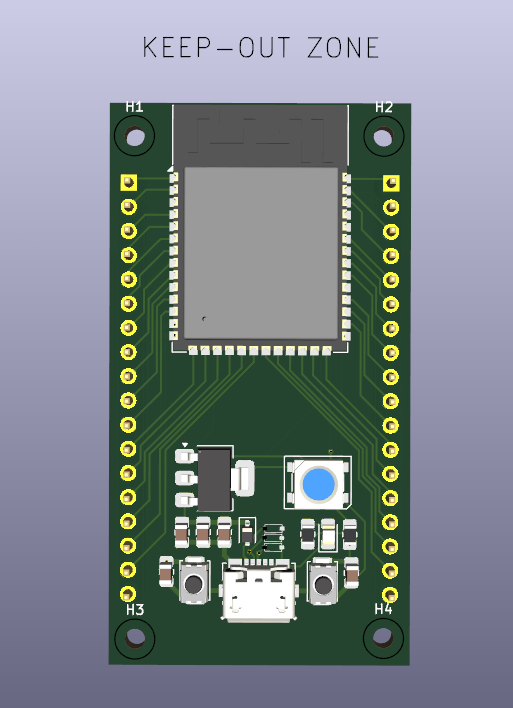

# ESP32-S3 Development Board

This repository documents a **personal ESP32-S3 based development board** designed for learning, experimentation, and embedded systems development.

---

## Table of Contents
1. [System Documentation](#system-documentation)
2. [Project Overview](#project-overview)
3. [Key Design Features](#key-design-features)
4. [Repository Structure](#repository-structure)
5. [Design Focus Areas](#design-focus-areas)
6. [Tools Used](#tools-used)
7. [Project Status](#project-status)
8. [Author](#author)

---

## System Documentation

- [Block Diagram Overview](docs/block_diagram_overview.md): High-level representation of the ESP32-S3 architecture.
- [Interface Overview](docs/interface_overview.md)
- [Power Architecture](docs/power_architecture.md)
- [Boot, Reset & Programming Flow](docs/boot_reset_programming.md): Details about programming workflows.
- [Board Visuals](docs/board_visuals.md)
- [Schematic Overview](hardware/schematics/schematic_overview.md)

### Board Images

---

## Project Overview

The ESP32-S3 Development Board is intended as a flexible platform for:
- Embedded systems learning and training.
- IoT and connectivity-based prototypes or experiments.
- Custom peripheral interfacing and hardware prototyping.

With USB-based programming, stable power regulation, and an accessible GPIO pin layout, the board is designed for development and ease of use.

---

## Key Design Features

- **ESP32-S3 microcontroller platform:**
  - Supporting Wi-Fi and Bluetooth connectivity for robust IoT development.
- **USB interface for versatile power and programming connectivity.**
- **Onboard voltage regulation (5 V to 3.3 V) ensures stable operation.**
- **Boot/reset circuits for efficient flashing and debugging workflows.**
- **Accessible GPIO support:**
  - UART, SPI, I²C, ADC, PWM interfaces.
  - Onboard status LED for development/debugging purposes.

---

## Repository Structure
- `docs/`: Documentation and architecture details.
- `hardware/`: Contains the board schematics and PCB artwork.
- `diagrams/`: Block and interface diagrams.
- `images/`: Photos and rendered views of the ESP32-S3 board.
- `README.md`: Main project documentation.

---

## Design Focus Areas

Key aspects of the design include:
1. Power Supply and Regulation strategy.
2. Boot Configuration and Reset Logic.
3. GPIO Layout for versatility and ease of use.
4. USB Signal Routing and Connectivity.
5. **Hardware Reliability** through layout planning.

---

## Tools Used

The following tools were used during development:
- [KiCad](https://www.kicad.org/): Design and layout of schematics/PCBs.
- [ESP-IDF](https://github.com/espressif/esp-idf): Development framework.
- Arduino (planned firmware compatibility).

---

## Disclaimer

This is a **personal hardware project** for education and learning.  
**Not intended for commercial or safety-critical applications.**

---

## Project Status

This project is **functionally complete**. Further updates, if added, will aim at incremental improvements or enhancements for learning purposes.

---

## Author

Smit Gaikwad  
Electronics & Telecommunication Engineer  
